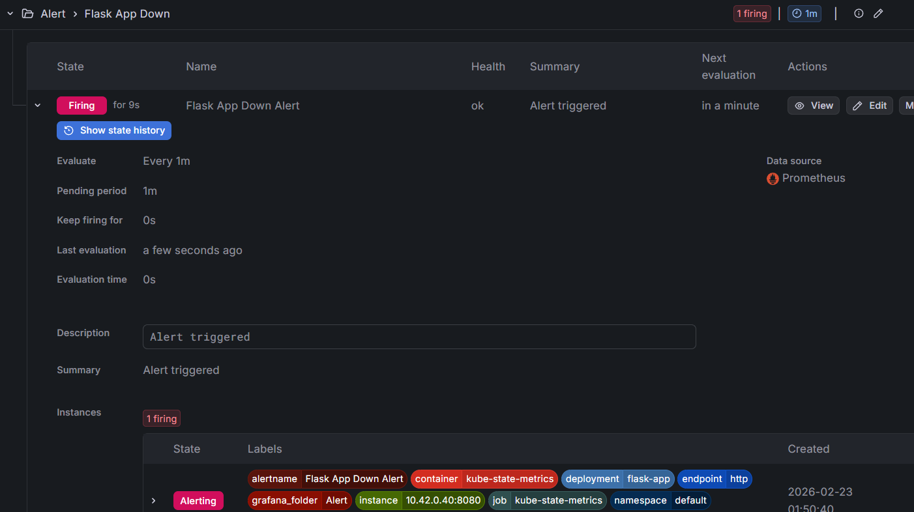

# 🚀 High-Availability Container Orchestration & Proactive Monitoring

---

## 📌 Project Overview

This project demonstrates a **production-grade transition** from a Legacy Server environment to a Modern Kubernetes Cluster.

It features:

- Self-healing infrastructure  
- Proactive monitoring  
- Automated data migration  
- Bit-for-bit integrity verification  

> 🎯 **Key Outcome:** Achieved real-time visibility into system metrics and demonstrated a reliable pathway for migrating legacy server data into a modern containerized environment.

---

## 🛠 Tech Stack

- **Orchestration:** Kubernetes (K8s)  
- **Containerization:** Docker  
- **Monitoring:** Prometheus & Grafana  
- **Automation:** Ansible & Python  
- **Storage:** Persistent Volume Claims (PVC)  

---

## 🏗 Key Features

---

### 1️⃣ Proactive Observability

Integrated a Prometheus-based monitoring stack with custom Grafana dashboards to eliminate infrastructure blindness.

- **Real-time Health Tracking**  
  Visualizes pod availability and resource consumption via PromQL.

- **Storage Monitoring**  
  Tracks volume growth in Megabytes (MB) to visualize real-time data ingestion.


---

### 2️⃣ Automated "Cloud-to-Cloud" Migration

Built a migration engine that simplifies complex data movement into a single-command execution.

- **Integrity Assurance**  
  The Python engine calculates **SHA256 hashes** at source and destination to guarantee zero corruption.

- **Dynamic Orchestration**  
  Ansible automates pod discovery and securely transfers legacy data into Kubernetes Persistent Volumes.


---

### 3️⃣ Resilience & Self-Healing Architecture

The infrastructure is designed to survive failure scenarios.

By decoupling data (PVC) from compute logic (Pods), the system demonstrates:

- **Data Persistence**  
  Migration data remains intact even after scaling deployments down to zero.

- **Self-Healing Recovery**  
  Kubernetes automatically reschedules pods while Grafana captures downtime and recovery events.

- **Automated Alerting**  
  Monitoring stack triggers alerts during simulated failure conditions.


*Migration activity visualized as a storage spike.*




---

## 🏃 How to Demo

Although the underlying architecture is complex, execution is streamlined.

---

### 1️⃣ Deploy Infrastructure

```bash
kubectl apply -f infrastructure/
```

> ⚠️ **Note:**  
> The simulation assumes a local directory `~/legacy_server/data` exists with files ready for migration.

---

### 2️⃣ Execute Verified Migration

```bash
ansible-playbook automation/migration.yml
```

---

### 3️⃣ Validate Results

- Check the Grafana dashboard for the storage spike  
- Confirm terminal output shows `✅ MATCH` for all files  

---

## ✅ What This Project Demonstrates

- Real-world Kubernetes operations  
- Monitoring-driven infrastructure validation  
- Secure, integrity-verified data migration  
- Production-style self-healing design  
- Observability-first architecture  

---

📈 Designed to simulate real enterprise modernization workflows.
