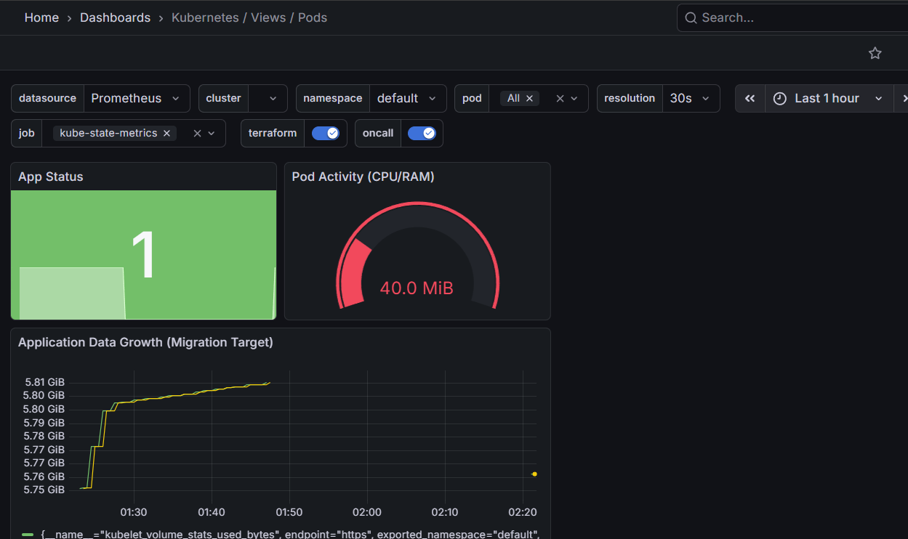
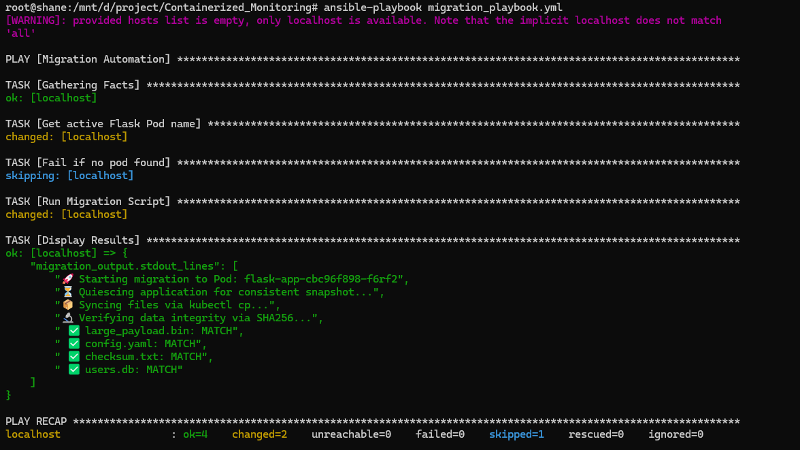
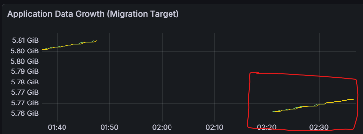
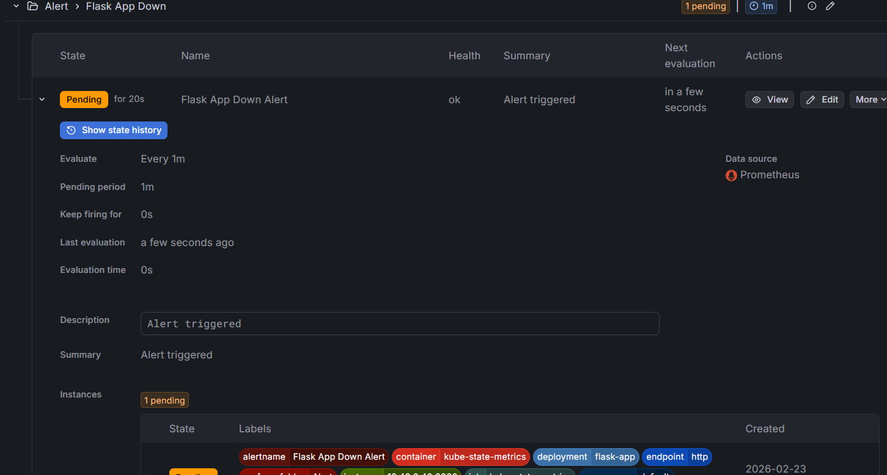

# High-Availability Container Orchestration & Proactive Monitoring

## 🚀 Project Overview
This project demonstrates a production-grade transition from a **Legacy Server** environment to a **Modern Kubernetes Cluster**. It features a self-healing infrastructure, proactive monitoring, and an automated data migration pipeline with bit-for-bit integrity verification.

> **Key Outcome:** Achieved real-time visibility into system metrics and demonstrated a reliable pathway for migrating legacy server data into a modern containerized environment.

## 🛠 Tech Stack
* **Orchestration:** Kubernetes (K8s)
* **Containerization:** Docker
* **Monitoring:** Prometheus & Grafana
* **Automation:** Ansible & Python
* **Storage:** Persistent Volume Claims (PVC)

---

## 🏗 Key Features

### 1. Proactive Observability
Integrated a Prometheus-based monitoring stack with custom Grafana dashboards to eliminate "infrastructure blindness."
* **Real-time Health Tracking:** Visualizes pod availability and resource consumption via PromQL.
* **Storage Monitoring:** Specifically configured to track volume growth in Megabytes (MB) to visualize data ingestion.



### 2. Automated "Cloud-to-Cloud" Migration
Built a sophisticated migration engine that simplifies complex data movement into a single-command execution.
* **Integrity Assurance:** The Python engine calculates **SHA256 hashes** at the source and destination, ensuring zero corruption.
* **Dynamic Orchestration:** Ansible automates Pod discovery and handles the secure transfer of legacy data into Kubernetes Persistent Volumes.



### 3. Resilience & Self-Healing
The infrastructure is architected to survive failures. By decoupling data (PVC) from logic (Pods), I verified:
* **Data Persistence:** Migration data remained intact even after total deployment scale-down to zero.
* **Self-Healing:** Kubernetes successfully rescheduled pods while Grafana captured the downtime event and recovery.
* **Alerting:** Monitoring stack successfully triggered downtime alerts during failure simulations.


Migration Shows Spike in Graph.




---


## 🏃 How to Demo
While the underlying logic is complex, the interface is streamlined for automation:

1. **Deploy Infrastructure:**
   ```bash
   kubectl apply -f infrastructure/
